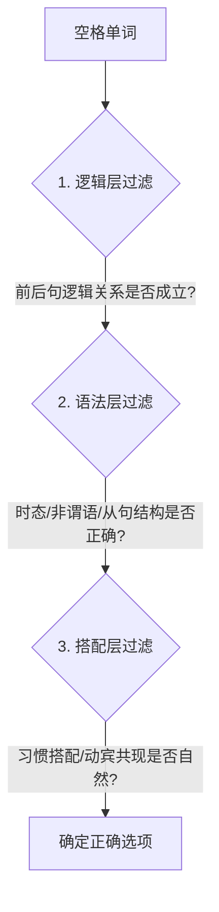

import DifficultyBadge from '@site/src/components/DifficultyBadge';

# PET3 语言知识运用核心策略 <DifficultyBadge level="B1" />

> PETS-3 语言知识运用（俗称**“完形填空”**）共由 **1 篇 200-250 词**的短文和 **20 道选择题**组成。很多考生认为这个板块纯粹考“背单词和语法”，其实不然。它的核心考查在于：**在完整的语篇语境下进行词汇、语法与逻辑的三维多重判断。**

---

## 📊 一、考情大纲与分值

完形填空排在听力之后，是笔试的第一项语篇理解题。

* **题量**：20 道单项选择题
* **分值**：每题 1 分，共计 20 分（在笔试总分中占比 20%）
* **建议时间**：**15 分钟**（平均每题 45 秒，含涂卡时间）

---

## 🔑 二、“三层筛选”解题法则

拿到一篇完形填空，不能单纯看空格所在的单句，必须像洋葱一样，由表及里，通过以下三层过滤器进行筛选：

### 1. 🧩 逻辑层 (Logic Level)
* **关注点**：上下文的承接、转折、因果、让步等句际关系。
* **突破口**：寻找逻辑信号词，如 `however` (转折)、`therefore` (因果)、`instead` (相反)、`in addition` (递进)。

### 2. 🔤 语法层 (Grammar Level)
* **关注点**：时态一致性、非谓语动词形式、主谓一致、各种从句的引导词（如定语从句中的指代关系）。
* **突破口**：理清空格所在句子的主干，判断空格是句子的谓语还是修饰成分。

### 3. 🤝 搭配层 (Collocation Level)
* **关注点**：固定短语、介词搭配、动宾搭配（如 `make a decision` 而不是 `do a decision`）。
* **突破口**：培养语感，记住词汇的“社交圈”，不要将单词拆开来孤立记忆。

---

## 🏃 三、高效完形填空“8步做题法”

想要在 15 分钟内快速拿到 15 分以上，在考场上应遵循以下标准流水线作业：

1. **第 1-2 分钟：快速通读全文** 
   - 略过空格，通读全文，摸清文章的主题、大意和基本态度色彩。
2. **标记显性逻辑词** 
   - 顺手圈出文章中天然存在的 `but`, `although`, `so`, `because` 等逻辑连接词。
3. **首轮快速攻克“确定题”**
   - 优先填入一眼能看出来的固定搭配、介词短语或明显的时态题。
4. **二轮聚焦“逻辑指代题”**
   - 结合上下文，寻找代词（`it, they, this`）的实际指代对象，解决指代难题。
5. **巧用“代入对比法”**
   - 当剩下两个选项摇摆不定时，将单词代入句子，大声默读，检验哪个在语篇中最为通顺。
6. **暂跳难题，保持节奏**
   - 如果某题超过 60 秒没有思路，先标记并跳过，绝不在单题上浪费时间。
7. **全局时态复核**
   - 检查整篇文章的时态基调，确保没有出现孤立的奇特时态。
8. **涂卡前复查**
   - 重点检查易错的名词单复数、冠词使用、主谓一致，确认无误后涂卡。

---

> 🚀 **完形填空第二步**：攻克高频考点语法专项 [语法快判规则与图解](./grammar-points)。
