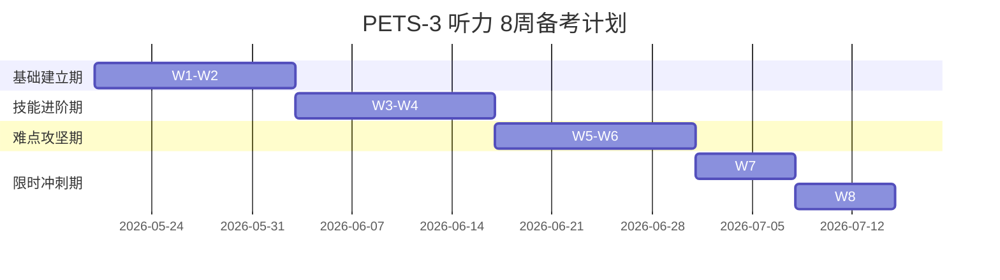

import DifficultyBadge from '@site/src/components/DifficultyBadge';

# PET3 听力备考全攻略 <DifficultyBadge level="B1" />

> PETS-3（全国英语等级考试三级）听力部分总分 **25 分**，在总成绩中占比极高。听力考试最大的挑战在于**录音仅播放一遍**，没有任何回听机会。本章将为你系统解构听力的考查 spec 并制定精密的复习计划。

---

## 📊 一、试卷结构与分值

听力部分由 A、B 两节组成，共 25 道单项选择题，总时长约 **12 分钟**。

| 部分 | 题型 | 题量 | 材料规模 | 播放次数 | 计分权重 |
| :--- | :--- | :---: | :---: | :---: | :---: |
| **A 节** | 短对话 (Short Conversations) | 10 题 | 约 400 词 | **1 遍** | 10 分 |
| **B 节** | 长对话/独白 (Long Talks/Passages) | 15 题 | 约 800 词 | **1 遍** | 15 分 |
| **合计** | **选择题** | **25 题** | **约 1200 词** | — | **25 分** |

---

## 🎯 二、听力常考核心能力

PETS-3 听力重点考查考生在真实语境中获取信息的能力，题目主要围绕以下四种维度展开：

1. **主旨要义理解 (Main Idea)**
   - 能够听懂对话或独白所围绕的核心话题、主旨。
   - 典型提问：*What is the main topic of the conversation?* / *What are the speakers talking about?*
2. **事实细节获取 (Specific Facts)**
   - 精准捕捉时间、地点、具体数字、价格、原因、结果等具体信息。
   - 典型提问：*When did the accident happen?* / *How much did the man pay for the book?*
3. **说话者意图、观点与态度 (Attitudes & Intentions)**
   - 判断说话者是赞同、反对、怀疑还是持保留意见，能听出言外之意。
   - 典型提问：*What is the woman's attitude towards the plan?*
4. **合理推理与推断 (Inference)**
   - 根据对话中给出的线索，推断人物身份、他们之间的关系、或是事情接下来可能的走向。
   - 典型提问：*What is the relationship between the two speakers?* / *Where does the conversation most likely take place?*

---

## 📅 三、8 周听力提分系统计划

想要在“只听一遍”的考场上稳定发挥，必须经过有节奏的适应性训练。以下是专为 PETS-3 听力定制的 **8周阶梯式备战方案**（建议每天坚持练习 30-40 分钟）：



### 🎯 每日备考动作规范：
* **Day 1 - 5**：限时做题 ➡️ 查阅听力原文 ➡️ 标出答案所在的“信号词句” ➡️ 对照**错题复盘模板**分析错因。
* **Day 6 - 7**：对本周的错题进行“裸听/盲听”复训，直到不看文本能听懂每一个句子。

---

## ✍️ 四、错题复盘黄金模板

做错题是最好的提分机会，每次听力模考后，请使用以下格式将错题登记在错题本上：

```markdown
- [ ] **【听力错题登记表】**
  - **题号**：Part A - Q5
  - **题型**：□ 主旨 / ■ 细节 / □ 推断 / □ 态度
  - **失分原因**：
    - [ ] 没听清发音（连读/弱读/爆破）
    - [x] 听到关键词但反应慢，错过了后一句
    - [ ] 受干扰项（原词复现陷阱）误导
  - **原文关键信号词**：`but the flight was delayed by snow` (转折信号词 `but` 引导正确答案)
  - **正确依据句**：*"...we ended up waiting for another three hours because of the heavy snow."*
  - **下次注意**：听到转折词（but/however）时，注意力必须高度集中，答案往往紧随其后！
```

---

> 🚀 **听力通关第一步**：进入下一节，开始专项突破 [A节短对话实战策略](./part-a-short)。
