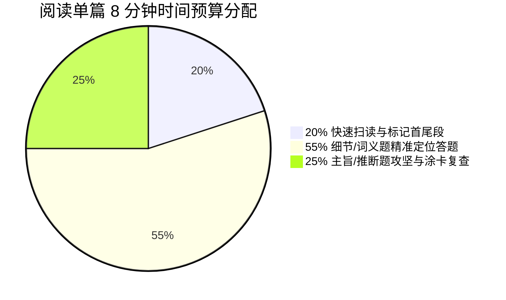

import DifficultyBadge from '@site/src/components/DifficultyBadge';

# PET3 阅读理解备考全攻略 <DifficultyBadge level="B1" />

> PETS-3 笔试中，**阅读理解占了极大的比重**。阅读提分的关键绝对不是“把文章中的每一个词都翻译成中文”，而是**“按题型精准定位 ➡️ 快速排除干扰项 ➡️ 锁定同义替换”**。本章为你解构阅读部分的测试大纲与时间管理核心。

---

## 📊 一、大纲要求与考情

PETS-3 阅读理解主要测试考生获取信息、理解文章主旨、进行逻辑推理以及根据上下文猜测词义的能力。

* **题量**：共 **20 道** 选择题（通常由 4-5 篇文章组成，每篇配有 4-5 道题）。
* **分值权重**：笔试总成绩中占比 30%（占比最重的客观题板块！）。
* **建议时间**：**35-40 分钟**。
* **字数规模**：单篇文章字数一般在 300-400 词之间，阅读总量约 1600-2000 词。

---

## 🎯 二、阅读理解考查的四维核心能力

在命题时，考官主要围绕以下四种维度来设计题目，考生复盘时也应当明确自己的错题究竟属于哪一类：

1. **事实细节检索 (Detail Search)** 🌟 *占比约 60%*
   - 能够根据题干中的人名、地名、数据等关键定位词，迅速回文定位并提取出正确的事实。
2. **上下文词句推测 (Contextual Guessing)**
   - 根据空格前后的句际逻辑、反义词或定义性描述，猜测生词或代词（如 *it, them, that*）的真实含义。
3. **主旨大意概括 (Main Idea Summary)**
   - 提炼段落的核心中心句，或是整篇文章的中心思想、最佳标题。
4. **逻辑推理与判断 (Logical Inference)**
   - 能够看懂作者的言外之意、隐含态度，并根据文章提供的事实得出合理的结论。**严禁主观凭空想象！**

---

## ⏱️ 三、考场黄金时间分配法则

阅读时间紧张，考生极易因为在某一两道难题上死磕而导致后面简单的题目没时间做。建议采用 **20% / 55% / 25% 黄金时间分配律**（以单篇 8 分钟为例）：

* **【1.5 分钟】快速扫读 (Skimming)**：
  - 快速读一下首段、各段的首句和尾段，在脑海中建立文章的整体框架，并随手用笔划出转折词。
* **【4.5 分钟】定位解题 (Locating)**：
  - 优先处理细节题和词义猜测题，通过题干词回文定位，90% 的答案都能在原文对应的句子中找到**同义替换**。
* **【2 分钟】主旨/推断与涂卡 (Reviewing)**：
  - 在细节题处理完后，对文章的把握已经很深，此时顺理成章地解决主旨大意题和作者态度推理题。

---

> 🚀 **阅读通关第一步**：进入下一节，学习四大核心题型的做题套路 [四大题型定位与解题法](./question-types)。
